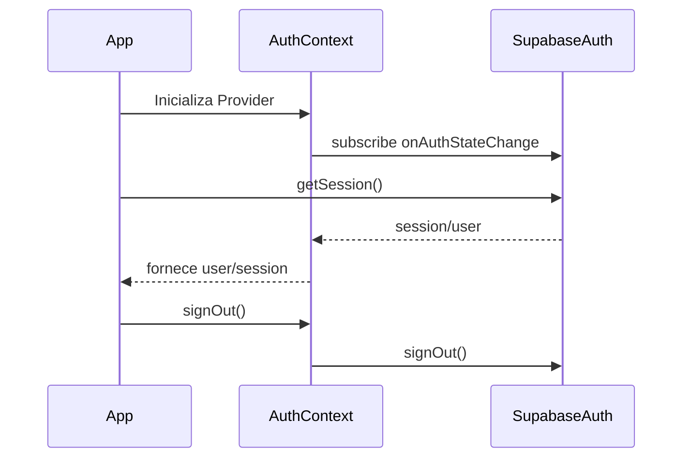
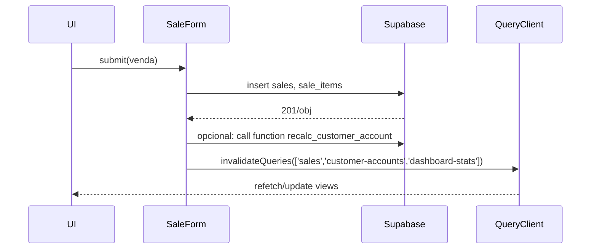
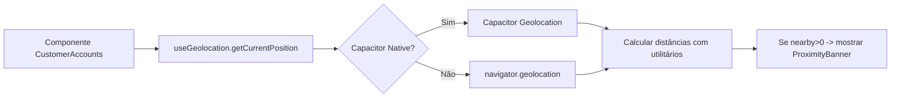
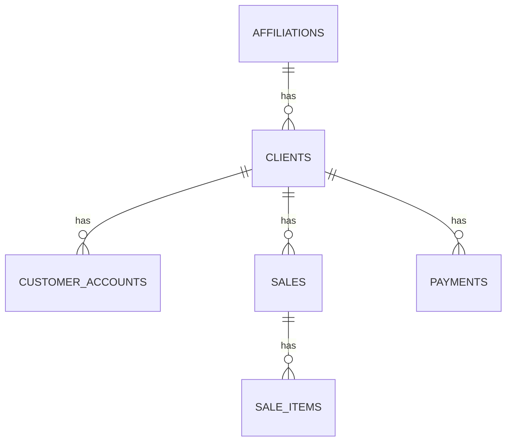
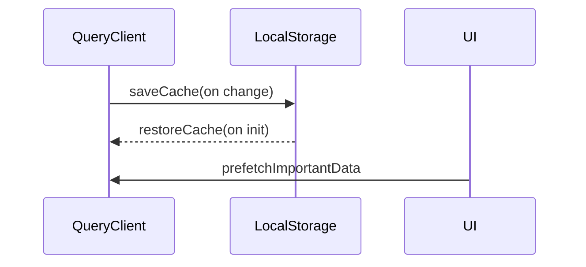

## Diagramas (Mermaid)

Abaixo estão os diagramas principais usados na documentação. Cole-os em um renderizador Mermaid para visualizar.

### 1) Fluxo de Autenticação

### 2) Fluxo de Criação de Venda

### 3) Fluxo de Proximidade (GPS → Banner)

### 4) Modelo de Dados (ER simplificado)

### 5) Cache & QueryClient (lifecycle)

