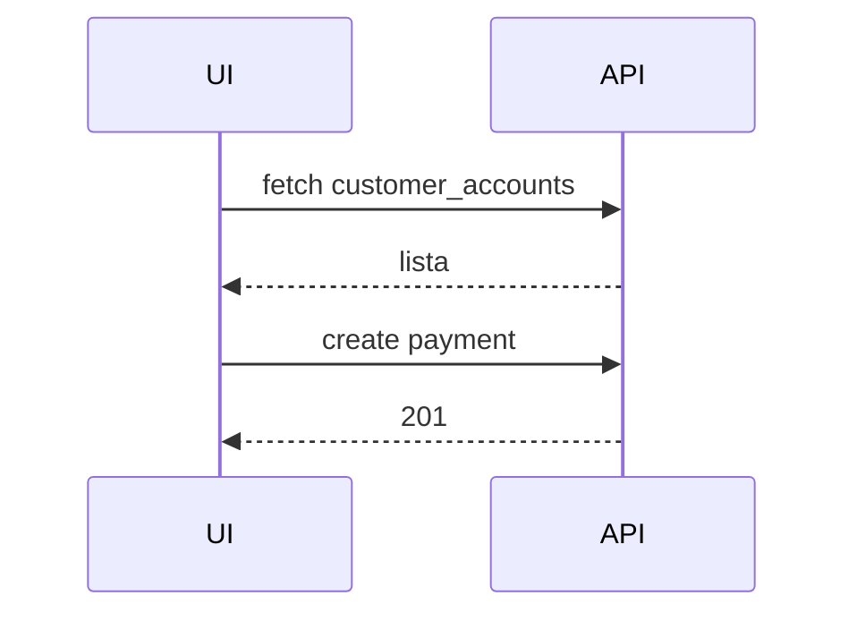

# Crediário — Guia de Uso e Técnicas

Visão: gerenciamento de fichas de clientes (saldo, vendas, recebimentos) com filtros por afiliação e detecção de proximidade.

Arquivos chave
- `src/pages/CustomerAccounts.tsx` — listagem e filtros
- `src/pages/AccountDetail.tsx` — detalhe da ficha com histórico
- `src/components/` — modais e formulários relacionados (ChargeModal, ClientForm)

Fluxo principal
- O usuário abre a lista de fichas → a página usa hooks para buscar `customer_accounts` via `QueryClient`.
- O banner de proximidade é alimentado por `useGeolocation` e utilitários de distância.
- Ao registrar uma cobrança/recebimento, o frontend insere em `payments` e invalida queries relevantes.

Checks e boas práticas
- Para mudanças de schema, adicione migration em `supabase/migrations`.
- Não contorne RLS: atualize políticas e documente o impacto no PR.

Mermaid (fluxo resumo)

